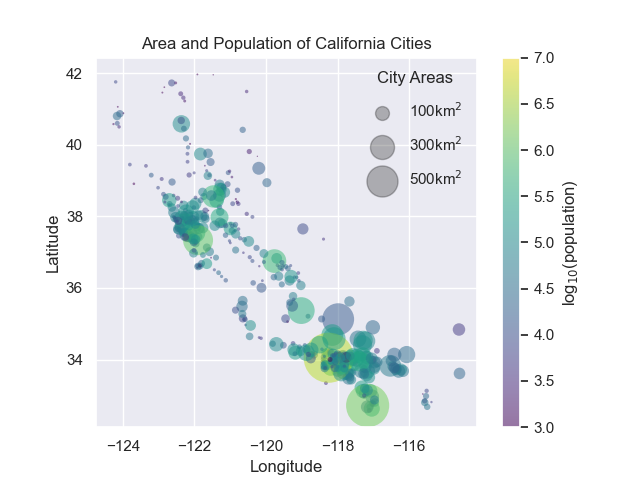
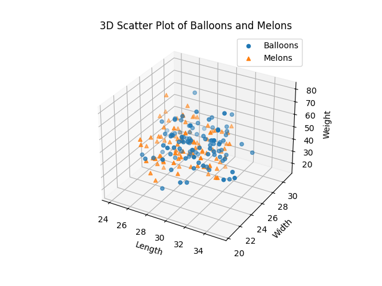

# 1. California_cities
### Data_Set_Numbers
The Python code in this notebook processes and visualizes data related to cities in California, focusing on their geographic locations, populations, and areas.
### Explanation
- **Reading Data:** The data is read from a CSV file using pandas.
- **Extracting Columns:** Latitude, longitude, population, and area columns are extracted for further processing.
- **Plotting Data:** The geographic locations of the cities are plotted on a scatter plot with matplotlib, with the color representing the logarithm of the population and the size representing the area.
- **Creating Legends:** Legends are created to differentiate between different city area sizes.
- **Displaying Plot:** The final scatter plot is displayed with proper labels, title, and a color bar.
### Features
- **Comprehensive Data Processing:** Efficient handling and extraction of data from a CSV file.
- **Customizable Plotting:** Use of seaborn for aesthetic enhancements and matplotlib for detailed customizations.
- **Interactive Visualization:** Clear visual representation of city data with legends and color bars for better interpretation.
### Out put

#
# 2. Apples & Bananas
### Explanation
- **Generating Data:** Synthetic data for the lengths, widths, and weights of apples and bananas are generated using numpy.
- **Plotting Data:** The data is visualized using 2D and 3D scatter plots with matplotlib.
- **Customizing Plots:** Detailed customizations are applied to the plots, including labels, legends, and titles.
- **Comparative Analysis:** Visual comparison of the attributes of apples and bananas through clear and distinct plotting.
### Features
- **Data Generation:** Use of numpy for generating synthetic data with specific statistical properties.
- **Detailed Visualization:** Multiple plots for different attributes and comprehensive customizations for better insights.
- **Comparative Insights:** Clear comparison between two different fruit types using visual aids.
#
# 3. Balloons & Melons
### Explanation
- **Generating Data:** Synthetic data for balloon and melon dimensions are generated using numpy.
- **3D Scatter Plot:** The data is visualized in a 3D scatter plot using matplotlib.
- **Customizing Plot:** The plot is customized with labels for each axis, a title, and a legend to differentiate between balloons and melons.
- **Interactive Visualization:** A clear and interactive 3D scatter plot to show the differences in physical attributes between balloons and melons.
### Features
- **Data Generation:** Creation of synthetic data for three attributes with normal distribution.
- **3D Visualization:** Use of 3D scatter plots for a more immersive data analysis experience.
- **Clear Differentiation:** Distinct colors and markers for different data sets to enhance interpretability.
### Out put
