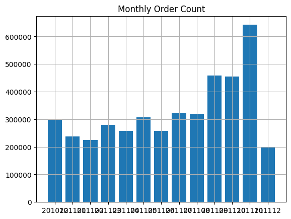

# Data Driven Growth with Python
This repository contains an implementation of the concepts described in the "Data-Driven Growth with Python" article from `Towards Data Science`. The notebook `Data_Driven_Growth.ipynb` includes data analysis and visualization techniques to understand key metrics for growth.
### Overview
This project is divided into several sections, each focusing on different aspects of data-driven growth. The main goals are to understand and visualize customer behavior, identify key performance indicators (KPIs), and apply these insights to drive business growth.
### Results and Insights
- **1- Monthly Revenue:** This clearly shows our revenue is growing especially Aug ‘11 onwards (and our data in December is incomplete).

- **2- Monthly Revenue Growth Rate:** we saw 36.5% growth previous month (December is excluded in the code since it hasn’t been completed yet).

- **3-Monthly Active Customers:** In April, Monthly Active Customer number dropped to 817 from 923 (-11.5%).

- **4-Monthly Order Count:** As we expected, Order Count is also declined in April (279k to 257k, -8%)

- **5-Monthly average revenue:** Even the monthly order average dropped for April (16.7 to 15.8). We observed slow-down in every metric affecting our North Star.

- **6-New and Existing Customers:** Existing customers are showing a positive trend and tell us that our customer base is growing but new customers have a slight negative trend.

- **7-New Customer Ratio:** New Customer Ratio has declined as expected (we assumed on Feb, all customers were New) and running around 20%.

- **8-Monthly Retention Rate:** Monthly Retention Rate significantly jumped from June to August and went back to previous levels afterwards.

### Conclusion
This project demonstrates the power of data-driven analysis in understanding and driving business growth. By leveraging key metrics and advanced analytics, businesses can make informed decisions that enhance customer retention and optimize growth strategies.