# Assignments-43
## 1-Finding Nemo & Dory
In this project we will predict the position of two fishes that they name are ``Nemo`` & ``Dory``.
the results of this project have prepared blow:
### Steps and Results
1. Original Image
- The original image of a clownfish in its natural habitat is displayed below.

2. Image Thresholding
- The image is converted to a binary image using thresholding. This step highlights the fish by distinguishing it from the background based on pixel intensity.

3. Masked Image
- The binary mask is applied to the original image to isolate the clownfish. This step helps in visualizing only the relevant parts of the image, making the fish stand out.

4. Alternative Image
- Another image of a clownfish is processed to demonstrate consistency in results across different images.

5. Alternative Image Thresholding
- Thresholding is applied to the alternative image to create a binary mask.

6. Alternative Masked Image
- The binary mask is applied to the alternative original image, isolating the clownfish.

-
| Nemo 1(train) | Nemo 2(test) | Dory 1(train) | Dory 2(test) |
|---------|---------|---------|---------|
| 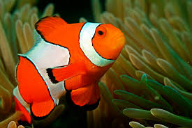 | 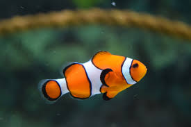 | 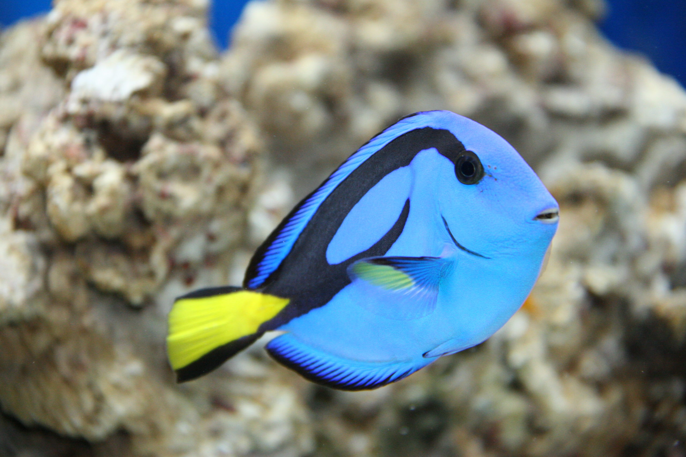 | 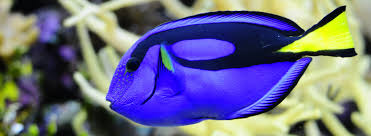 ||---------|---------|---------|---------|
| 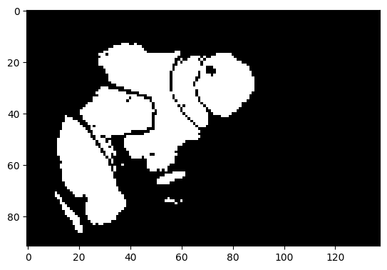 | 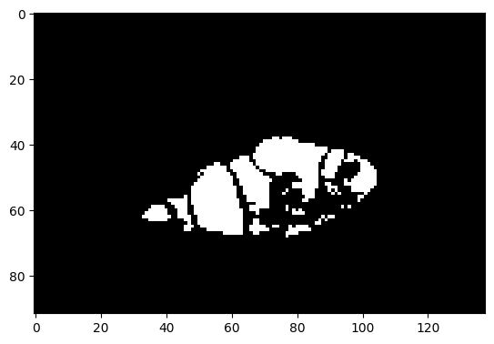 | 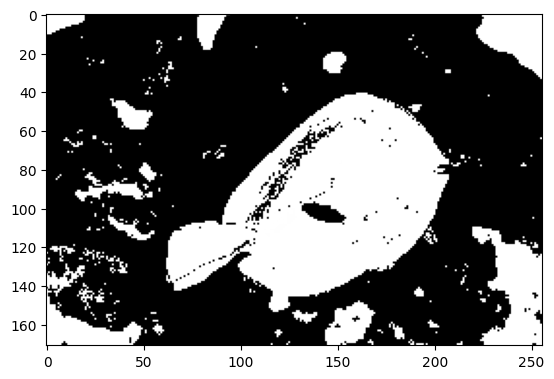 |  ||---------|---------|---------|---------|
| 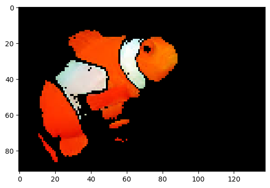 | 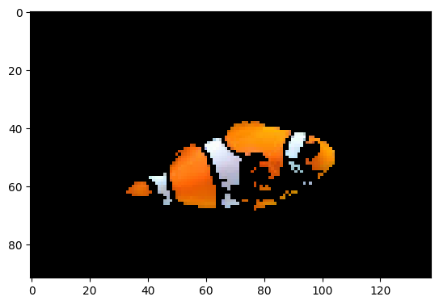 | 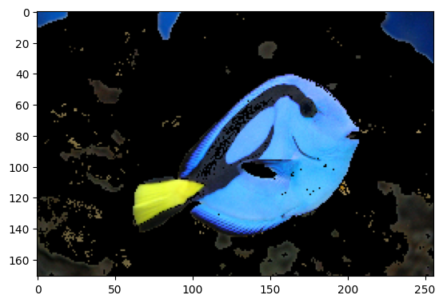 |  |

## 2-Iris data set
IN this project we calculate and predict of Iris data set from ``skite-learn`` and the algorithm of machine learning that we use is KNN moreover, the value of K are 3,5 and 7. At the below we can see the confusion matrix and the score of each algorithm.

| K | Accuracy of ``Amirreza`` (%) | Accuracy of ``Skite-learn`` (%) | canfusion matrix |
|---------|---------|---------|---------|
|3 |[90]|[90]|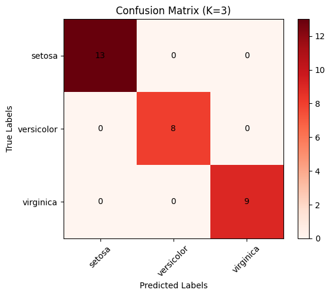|
|5 |[93]|[93]||
|7 |[96]|[96]||
## 3-Breast Cancer data set
IN this project we calculate and predict of Brest Cancer data set from ``skite-learn`` and the algorithm of machine learning that we use is KNN moreover, the value of K are 3,5 and 7. At the below we can see the confusion matrix and the score of each algorithm.

| K | Accuracy of ``Amirreza`` (%) | Accuracy of ``Skite-learn`` (%) | canfusion matrix |
|---------|---------|---------|---------|
|3 |[94]|[94]|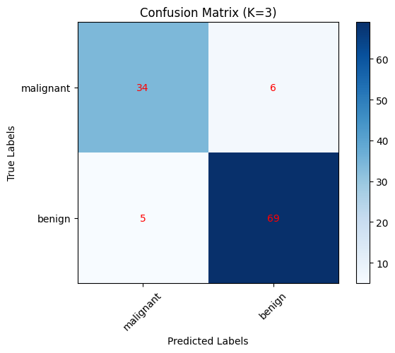|
|5 |[95]|[95]||
|7 |[95]|[95]||