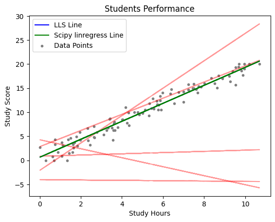

# 1. Students Performance (Regression)
- **Objective**: To predict student grades based on the number of study hours using a simple linear regression model.
- **Dataset**: Synthetic data simulating a linear relationship between study hours (`X`) and grades (`Y`), with added noise.
- **Steps**:
  1. **Data Generation**: Create a random dataset representing study hours and corresponding grades with some noise.
  2. **Data Splitting**: Split the dataset into training and testing sets.
  3. **Visualization**: Visualize the data points and plot incorrect random lines as well as the correct regression line using the LLS method.
  4. **Linear Regression**:
      - Implement the LLS method to find the best-fit line for the dataset.
      - Fit the model to the training data and predict grades.
  5. **Comparison**: Draw the LLS regression line and compare it with the line obtained using Scipy's `linregress` method.
- **Output**: A scatter plot of the data points, with a blue line representing the LLS regression line and a green line showing the Scipy regression line.

# 2. House Prices (Regression)
- **Objective**: To predict house prices using two features, median income (`MedInc`) and average number of rooms (`AveRooms`), from the California housing dataset.
- **Dataset**: California housing dataset, which is publicly available and does not have the ethical concerns associated with the Boston housing dataset.
- **Steps**:
  1. **Data Loading**: Load the California housing dataset, focusing on the `MedInc` and `AveRooms` features to predict house prices.
  2. **Feature Standardization**: Standardize the features for better numerical stability in the regression process.
  3. **Data Splitting**: Split the dataset into training and testing sets.
  4. **Linear Regression**:
      - Implement the multivariable LLS method to find the best-fit plane for the dataset.
      - Fit the model to the training data and predict house prices.
  5. **3D Visualization**: Visualize the results in a 3D plot, with the scatter plot of actual data points and the predicted plane.
- **Output**: A 3D plot showing the scatter points of actual house prices and the regression plane fitted by the LLS method.

### Ethical Note
- The Boston housing dataset was not used in the second problem due to ethical concerns. The California housing dataset was chosen as an alternative, which is more suitable for public use without ethical issues.