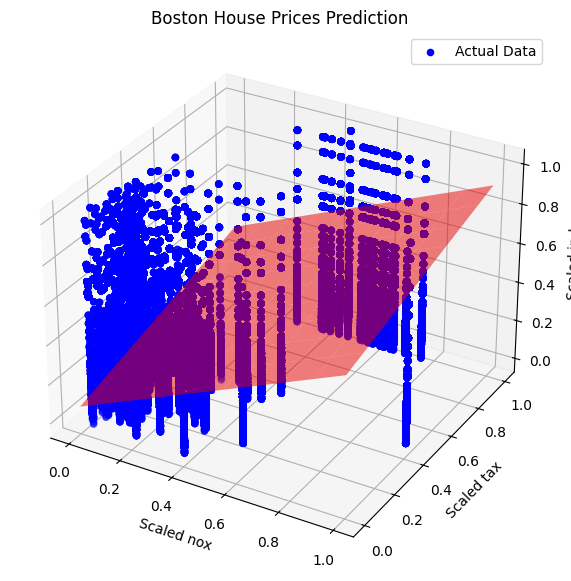
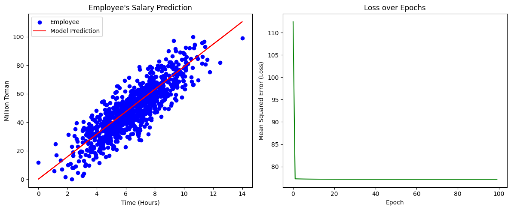
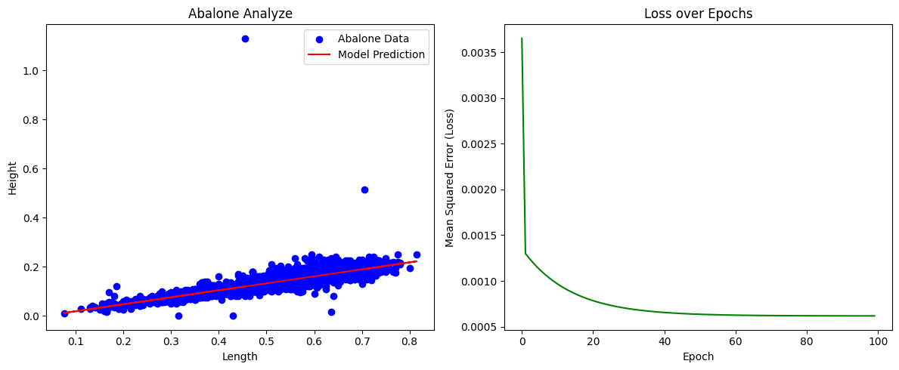

# Project Analysis

This repository contains analysis and modeling for three datasets: Boston House Prices, Employee's Salary, and Abalone Size Prediction. Each notebook provides an overview of data processing, model training, and evaluation metrics, including the Mean Squared Error (MSE) for model performance.

---

## Files and Descriptions

1. **BostonHousePrices**
   - **Description**: This notebook analyzes the Boston Housing dataset to predict housing prices based on various features such as crime rate, tax rate, and proximity to employment centers.
   - **MSE Value**: 0.1032
   - **Sample Output**:
     

2. **Employee'ssalary.ipynb**
   - **Description**: This notebook examines employee data to predict salaries based on features like education, experience, and position.
   - **MSE Value**: 89.1635
   - **Sample Output**:
     

3. **Abalone.ipynb**
   - **Description**: The Abalone dataset is used in this notebook to estimate the size of each abalones from physical measurements.
   - **MSE Value**: 0.0027
   - **Sample Output**:
     