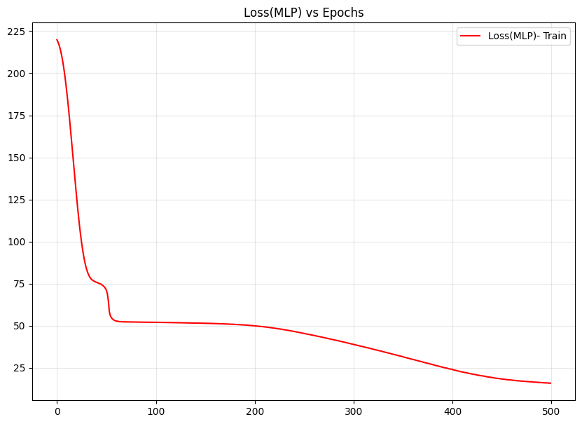
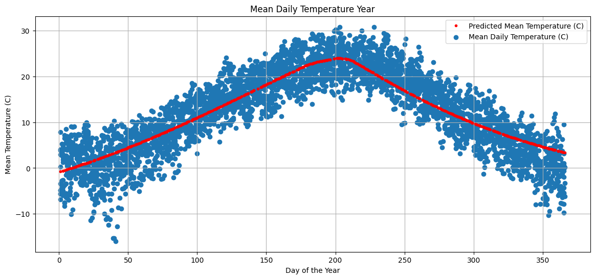
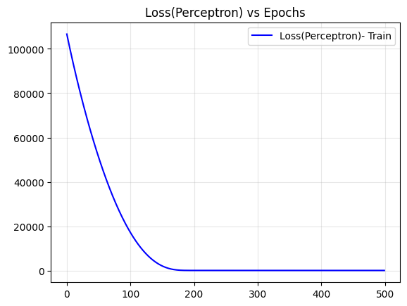
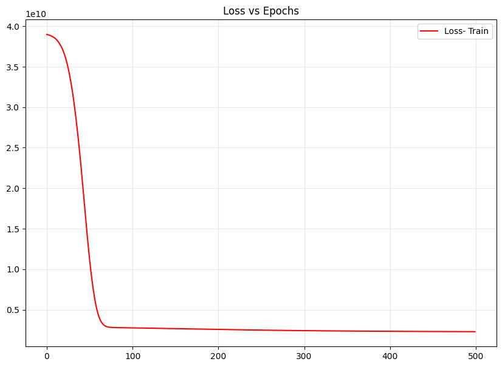

# Neural Network Implementation for Weather Prediction and House Price Estimation

## 1. Weather Prediction

### Objective:
The goal of this task was to predict daily mean temperatures using neural networks and compare the performance of a Multilayer Perceptron (MLP) and a single-layer Perceptron.

### Results:
- **MLP Loss**: 15.35
- **Perceptron Loss**: 85.67

### Performance Comparison:
| Model       | Loss   |
|-------------|--------|
| MLP         | 15.35  |
| Perceptron  | 85.67  |

### Visualizations:
1. Loss vs. Epochs (MLP): 
2. Predicted vs. Actual Mean Temperature: 
3. Loss vs. Epochs (Perceptron): 

### Insights:
The MLP outperformed the single-layer Perceptron significantly, achieving a lower loss and better temperature prediction accuracy.

---

## 2. House Price Prediction

### Objective:
To develop a neural network model for predicting house sale prices, splitting the dataset into 80% training and 20% validation, and achieving a loss below $50,000.

### Results:
- **Train Loss**: 2,282,086,400.0

### Visualizations:
- Loss vs. Epochs for the house price prediction model: 

### Final Predictions:
Predicted house prices were saved to `House_Price_Prediction.csv` using the following code snippet:
```python
prediction_test = model.predict(X_test)
prediction_test = pd.DataFrame(prediction_test, columns=["SalePrice"])
prediction_test.to_csv("House_Price_Prediction.csv", index=False)
```

---

## Conclusion:
The project successfully implemented neural networks for both weather prediction and house price estimation. The MLP model demonstrated superior performance in the weather prediction task, while the house price prediction model needs further optimization to meet the desired loss threshold.
