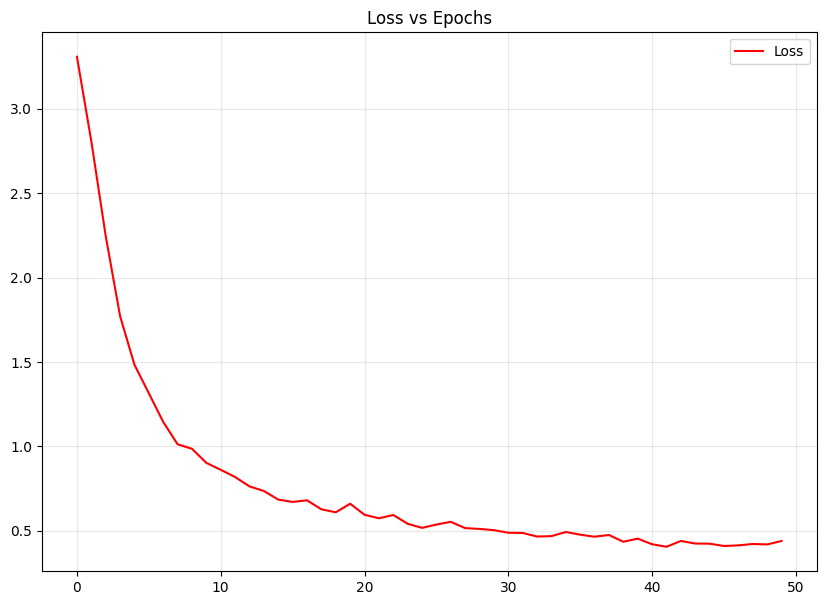

# Persian Face Recognition with MLP

This project is designed for recognizing Persian actors using machine learning models. The project uses the ArcFace model for feature extraction from images, and then a Multi-Layer Perceptron (MLP) model is trained for actor identity prediction.

## Project Steps

### 1. Feature Extraction from Images
Initially, the images of each actor are stored in separate folders, with each folder containing different images of the respective actor. The DeepFace library is used along with the ArcFace model to extract numerical feature vectors (embeddings) from the images. These features are saved in a CSV file.

### 2. MLP Model Creation and Training
After feature extraction, a Multi-Layer Perceptron (MLP) model is built and trained to identify actors based on the extracted features. The model includes Dense and Dropout layers to prevent overfitting.

### 3. Model Saving
The trained MLP model is saved for future use and predictions.

### 4. Predicting New Images
The trained model can be used to predict new images by extracting the feature vector for the given image and passing it through the trained MLP model. 

## Requirements

- Python 3.x
- DeepFace
- TensorFlow
- Keras
- scikit-learn
- pandas
- numpy
- matplotlib

## Results
The model achieves the following performance on the test set (Mehran Modiri):
- Train Loss: 0.40
- Train Accuracy: 88%
