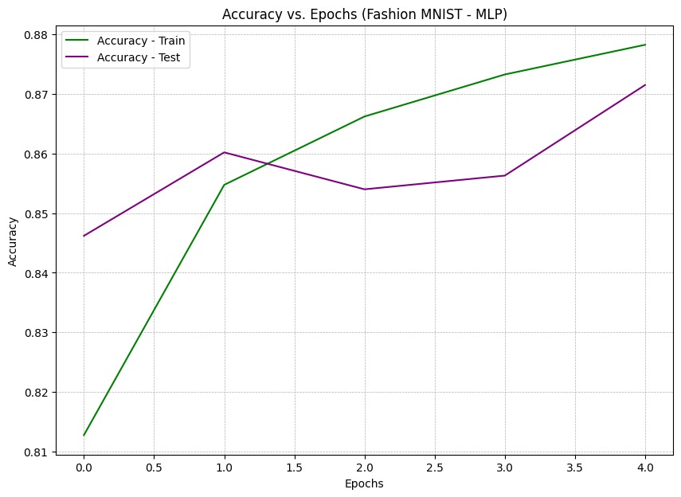

# Handwritten Digit Recognition using TensorFlow

## Introduction
This repository contains code for training neural network models on various image datasets including MNIST, Fashion MNIST, CIFAR-10, and CIFAR-100. The models include a Multi-Layer Perceptron (MLP) and a combination of Convolutional Neural Networks (CNN) and MLP, trained to classify images.

## File Structure
- `MNIST_MLP`: Trains an MLP model on the MNIST dataset.
- `FashionMNIST_MLP`: Trains an MLP model on the Fashion MNIST dataset.
- `CIFAR10_MLP`: Trains an MLP model on the CIFAR-10 dataset.
- `CIFAR100_MLP`: Trains an MLP model on the CIFAR-100 dataset.

(Similar descriptions for files related to Deep Learning models)

## Results
The accuracy of the models on different datasets is summarized in the table below:

| Dataset       | MLP (Machine Learning) | CNN + MLP (Deep Learning) |
|---------------|------------------------|---------------------------|
| MNIST         | 98%                    | 99%                         |
| Fashion MNIST | 87%                    | 90%                         |
| CIFAR-10      | 34%                    | 68%                         |
| CIFAR-100     | 2.3%                   | 31%                         |

## Charts
Below are charts demonstrating the performance of the models during the training epochs. You can view these charts directly in the respective notebooks.

